# MDXpress

<div style="display: flex; justify-content: center;">
  
</div>
<br />
MDXpress는 사용자가 MDX 문법을 자유롭게 작성하고 편집할 수 있는 온라인 위지윅(WYSIWYG) 코드 에디터 서비스입니다. <br/>
실시간 프리뷰와 함께 다양한 써드파티 라이브러리를 지원하며, 사용자가 작성한 코드의 현재 상태를 저장하고 링크를 통해 다른 사람과 손쉽게 공유할 수 있는 기능을 제공합니다. <br />
<br />

> [!NOTE]
> 위지윅(WYSIWYG)이란 What You See Is What You Get의 약자로, 문서에 표시되는 것과 같은 형태로 콘텐츠를 보고 편집할 수 있는 편집 소프트웨어를 뜻하는 말 입니다.

### 🔗 Depoly URL : https://mdxpress.ohho.dev

<br />
<br />

# Content

- ### [✨ Stacks](#-stacks)
  - [Zustand를 사용한 이유](#️-zustand를-사용한-이유)
  - [styled-components를 사용한 이유](#️-styled-components를-사용한-이유)
- ### [🏛️ System Architecture](#%EF%B8%8F-system-architecture-1)
- ### [⚒️ Feature](#%EF%B8%8F-feature-1)
  - [실시간 코드 프리뷰](#1-실시간-코드-프리뷰)
  - [저장 및 링크를 통한 공유](#2-저장-및-링크를-통한-공유)
  - [써드파티 라이브러리 지원](#3-써드파티-라이브러리-지원)
- ### [🏔️ Challenges](#%EF%B8%8F-challenges-1)
  - [어떻게 코드 에디터에 써드파티 라이브러리를 지원해 줄 수 있을까?](#1-어떻게-써드파티-라이브러리를-지원해-줄-수-있을까)
    - [CDN 방식을 차용해보자](#1-1-cdn방식을-차용-해보자)
    - [라이브러리를 설치할수록 늘어만가는 서버의 부담](#1-2-라이브러리를-설치할수록-늘어만가는-서버의-부담)
    - [가상환경이라는 해답을 찾다](#1-3-vm과-docker중-어떤걸-사용할까)
  - [로그인 없이 코드를 저장할 수 있는데, 그럼 DB관리는?](#2-로그인-없이-코드를-저장할-수-있는데-그럼-db관리는)
    - [DB를 어떻게 효과적으로 관리할 수 있을까?](#2-1-db를-어떻게-효과적으로-관리할-수-있을까)
    - [TTL을 이용해서 3일 뒤에 데이터를 지워주자](#2-2-ttl을-이용해서-3일-뒤에-데이터를-지워주자)
    - [pre 미들웨어가 동작하지 않는 문제가 발생](#2-3-pre-미들웨어가-동작하지-않는다)
    - [changeStream을 도입하여 해결해보자](#2-4-changestream을-이용하여-mongodb-서버-내부를-직접-옵저빙-하자)
  - [textArea에 Syntax Highlighting을 입힐 수 있을까?](#3-textarea에-syntax-highlighting을-입힐-수-있을까)
    - [syntax highlighting은 어떻게 이루어지는걸까](#3-1-syntax-highlighting은-어떻게-이루어지는걸까)
    - [어떻게 사용자가 입력하는 문자열이 하이라이팅 된 코드처럼 보이게 할 수 있을까?](#3-2-어떻게-사용자가-입력하는-문자열이-하이라이팅-된-코드처럼-보이게-할-수-있을까)
    - [write영역과 view영역, 두 영역을 동기화 하기](#3-3-두개의-영역-동기화-하기)
- ### [🧪 Test](#-test-1)
  - [서버에서 데이터를 정상적으로 잘 가져와서 렌더링 할 수 있을까?](#서버에서-데이터를-정상적으로-잘-가져와서-렌더링-할-수-있을까)
  - [테스트시 서버 의존성을 끊어내자](#테스트시-서버-의존성을-끊어내자)
  - [MSW 도입 후 느낀점](#msw-도입-후-느낀점)
- ### [♻️ Refactoring](#%EF%B8%8F-refactoring진행중)
  - [타입스크립트](#1-typescript)
  - [Web-Worker](#2-web-worker로-백그라운드-스레드-활용해보기)
- ### [🤔 Memoir](#memoir)

<br />
<br />

# ✨ Stacks

### FrontEnd

<div style="display:flex;">
  
  
  
  
  
</div>

### BackEnd

<div style="display:flex;">
  
  
  
  
  
  
</div>

### Tools

<div style="display:flex;">
  
  
  
  
</div>

### Depoly

<div style="display:flex;">
  
  
</div>
<br />

### ❗️ <span style="color: #f66d2d">Zustand를 사용한 이유</span>

이전에 글로벌 상태 관리를 하기위한 툴로 Redux를 사용해본 경험이 있었습니다.
Redux는 Flux패턴을 사용하면서 `단방향 데이터 흐름`의 구조를 가져가는 상태관리 툴 입니다.<br />
이로써 상태를 더욱 쉽게 예측 가능하게 하여 유지보수 측면에 긍정적인 효과가 있습니다.
다만 `Redux`를 사용하면서 느꼈던 단점은 아래와 같습니다. <br />

- **복잡한 보일러 플레이트**
  다른 상태관리 툴과 비교해 보았을 때 초기 보일러 플레이트를 구성하는 게 복잡합니다. (액션 타입, 액션 생성 함수, 리듀서 등등) <br />
  이에 따라 주로 초기 보일러 플레이트를 쉽게 구성하기 위해 도와주는 `RTK(Redux-Took-Kit)`와 함께 사용합니다.<br />
  <br />

`Zustand`는 이러한 단점을 극복하고 아래와 같은 특징을 갖고 있었습니다.

1. **간단한 보일러 플레이트**
2. **Redux와 동일한 Flux패턴 사용**
3. **Redux DevTools로 디버깅 지원**
4. **상대적으로 작은 라이브러리 크기**

다만 Redux보다 파생 상태를 관리하기에는 조금 부족하다는 단점 또한 존재하지만<br />
이번에 진행한 프로젝트의 규모와, 파생상태의 여부 등을 종합적으로 고려해보았을 때 `Zustand`를 사용하는 것이 합리적이라고 판단했습니다.
<br />

### ❗️ <span style="color: #DB7093">styled-components를 사용한 이유</span>

1. **상대적으로 낮은 러닝 커브** <br />
   → `tailwindCSS`는 static CSS가 미리 정의 돼 있고, 해당 스타일을 className에 할당하는 방식을 사용하기 때문에, 내가 원하는 스타일이 어떤 `className`으로 정의가 돼 있는지 알아야 합니다.
   3주라는 제한적인 기간 동안 프로젝트를 완성해야 하는 극한의 환경이었기 때문에, 유한한 시간을 효율적으로 사용해야 했습니다.

2. **미세한 스타일링 조정 가능** <br />
   → CSS 규칙을 직접 작성하는 방식으로 스타일이 적용되기 때문에, 제가 원하는 만큼 미세한 스타일 조정이 가능합니다.

3. **재사용 가능한 컴포넌트** <br />
   → `styled-components`는 런타임에 새로운 React 버튼 컴포넌트를 생성하기 때문에 스타일이 적용된 컴포넌트를 재사용할 수도 있고, 이에따른 컴포넌트 중심 개발이 가능해 집니다.

4. **유연한 스타일링** <br />
   → styled-components는 `CSS-in-JS` 라이브러리 이기 때문에 런타임에 스타일을 해석하여 적용하게 됩니다.
   이러한 특징 때문에 런타임에서 바뀌는 값에 대응하여 유연한 스타일링을 할 수 있습니다.

   <br />

`tailwindCSS`는 정적인 CSS를 제공하기 때문에, 번들 크기가 줄어들고 브라우저가 스타일을 해석하는 데 있어서 styled-components보다 빠르다는 장점이 존재하지만, <br />
앞으로의 프로젝트 리팩토링을 고려한다면 컴포넌트 재사용과, 유연한 스타일링이 가능하여 확장성이 좋은 `styled-components`를 사용하는 것이 더 적합하다고 판단했습니다.

<br />
<br />

# 🏛️ System Architecture

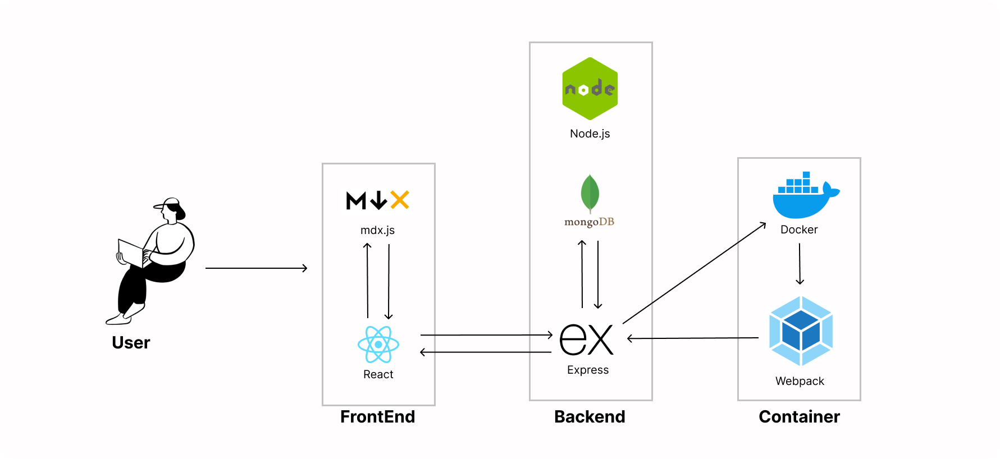

<br />
<br />

# ⚒️ Feature

### 1. 실시간 코드 프리뷰

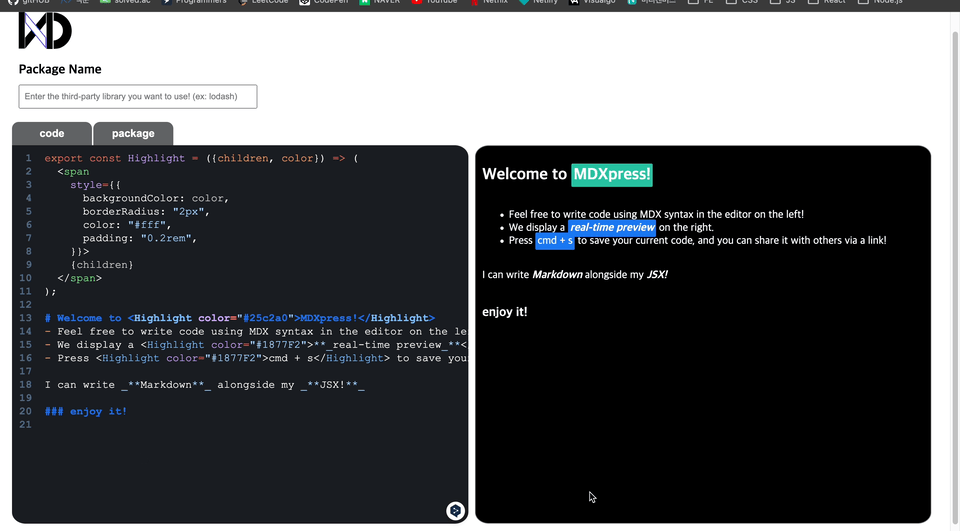
→ 사용자가 mdx문법을 이용하여 작성한 코드가 실시간으로 우측 화면에 프리뷰 됩니다.

> 문법적인 오류가 있을 경우에는 해당 오류에 대한 간략한 정보가 프리뷰에 렌더링 됩니다.

<br />

### 2. 저장 및 링크를 통한 공유

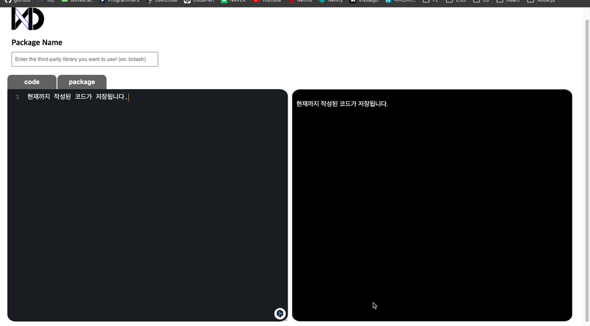

→ `CMD + S`를 누르면 사용자가 현재까지 작성된 코드를 저장할 수 있고, 저장이 완료가 되면 URL 링크가 제공이 됩니다.<br />
해당 링크를 통해서 다른 사람들에게 공유할 수 있고, 링크로 접속 시 저장되있던 상태로 에디터가 로드됩니다.

> 만약, 써드파티 라이브러리를 설치했다면 해당 링크로 접속 시 동일하게 자동으로 설치 됩니다.

<br />

### 3. 써드파티 라이브러리 지원

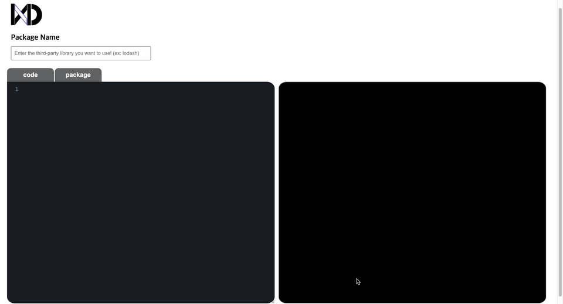
→ 사용자가 에디터 상에서 사용하고 싶은 써드파티 라이브러리가 있다면, 검색해서 설치 후 사용이 가능합니다.

> 존재하지 않는 라이브러를 입력 시 우측 상단에 에러 토스트가 출력됩니다.
> (lodash 라이브러리로 시연)

<br />
<br />

# 🏔️ Challenges

## 1. 어떻게 써드파티 라이브러리를 지원해 줄 수 있을까?

### 1-1. CDN방식을 차용 해보자

초기에는 클라이언트 측에서 사용자가 필요로 하는 패키지를 설치한다면, 코드 에디터 상에서 해당 패키지를 사용할 수 있다고 생각하였습니다. <br />
그러나 예상과 달리, 로컬 클라이언트에서 npm을 통해 설치한 라이브러리는 사용자가 작성하는 코드 에디터 상에서 사용할 수 없었습니다.<br />
이는 사용자가 작성한 MDX 문자열이 MDX에서 제공하는 `compile API`를 통해 JSX 코드로 변환되며, 이후 run API를 통해 실행될 때 React 컴포넌트로 렌더링이 가능해지기 때문입니다. <br />
실행 시 `run API`를 통해 JSX 코드를 실행할 때 별도의 `jsxRuntime` 에서 실행되게 되며, 해당 런타임은 클라이언트가 실행되는 런타임과는 독립적입니다. <br />
따라서 MDX가 실행되는 환경에서는 클라이언트 로컬 측에 설치된 라이브러리의 존재를 인식할 수 없었습니다.

<div style="display: flex flex-direction: column">
  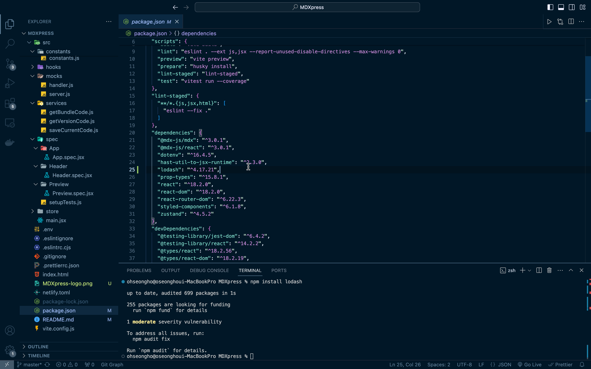
  <p>-> 로컬에 설치한 lodash 라이브러리</p>
  <br />
  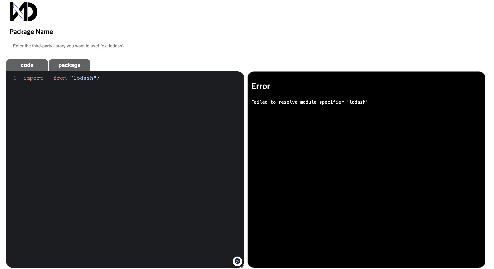
  <p>-> 사용자가 작성한 mdx에디터에서는 찾을 수 없는 모습.</p>
</div>
<br />

다른 방법을 찾아보기 위해서 여러 방향의 시도 중, 저는 전역 객체에 대해서는 접근할 수 있다는 것을 확인했고, 이를 활용하여 저희가 라이브러리를 사용하는 방식 중에 하나인 `CDN`으로 사용하는 방식에서 아이디어를 얻을 수 있었습니다.

`CDN`은 script 태그를 이용하여 전역적으로 해당 라이브러리를 로드시키고, 전역 변수를 통해서 접근하여 해당 라이브러리 API를 사용할 수 있게 하는 방식으로 동작합니다.

이처럼 사용자가 설치한 라이브러리를 CDN처럼 전역변수에 바인딩시킬 수만 있다면 mdx가 실행되는 런타임에서도 해당 라이브러리를 사용할 수 있을 것이라고 판단했습니다.

그렇다면<br />
_**"사용자가 설치하길 원하는 라이브러리를 CDN 방식으로 제공을 해주면 되지 않을까?"**_ 라고 생각했지만<br />
써드파티 라이브러리에는 CDN 방식을 제공하지 않는 라이브러리도 존재하기 때문에 CDN방식은 차용을 하되, <br />
해당 라이브러리의 직접적인 CDN은 제공하지 않는 방법을 택했습니다.

이에 따라서 처음에는 사용자가 사용하길 원하는 라이브러리를 input 창에 입력하면 해당 문자열을 추출하여 서버로 전달하게 되고,<br />
서버 측에서 `childprocess`를 통해서 병렬적으로 해당 패키지를 설치한 뒤, webpack을 이용하여 해당 라이브러리를 컴파일 및 번들링을 해줍니다.

저는 기존에 Vite만 사용해봤었기 때문에, webpack을 직접 설정해서 사용해 본 적은 이번에 처음이었습니다. <br />
webpack은 번들링을 하기 위해서 entryPoint를 기준으로 모든 `import•export`구문을 찾아
dependency graph를 생성한 뒤, 해당 그래프를 기준으로 하나의 파일로 묶는 방식으로 동작합니다.

이에따라서 설치한 패키지를 번들링 하기 위해서 패키지의 entryPoint를 webpack에게 제공해주어야 했고,<br />
해당 entryPoint는 `node_modules`의 해당 라이브러리가 설치된 디렉토리의 `package.json`에 `main`이라는 프로퍼티에서 경로를 찾을 수 있었습니다.

```jsx
// getEntryPoint.js
const path = require("path");
const fs = require("node:fs");

function getEntryPointPath(packageName) {
  const packageJsonPath = path.resolve(
    __dirname,
    "node_modules",
    packageName,
    "package.json",
  );

  const packageJson = JSON.parse(fs.readFileSync(packageJsonPath, "utf-8"));
  const entryPointPath = path.resolve(
    __dirname,
    "node_modules",
    packageName,
    packageJson.main || "index.js",
  );

  console.log(`${packageJson.name} ${packageJson.version}`);

  return entryPointPath;
}

module.exports = getEntryPointPath;
```

번들링 된 코드를 클라이언트 측으로 전달하여, 클라이언트 측에서는 해당 문자열을 `javascript Blob`형식으로 변환하여 script 태그를 생성합니다.

이후에 생성된 script 태그를 html에 추가해주면, CDN처럼 해당 라이브러리가 전역에 바인딩이 되어서 사용자가 mdx 실행 컨텍스트에서도 사용할 수 있게 구현하였습니다.

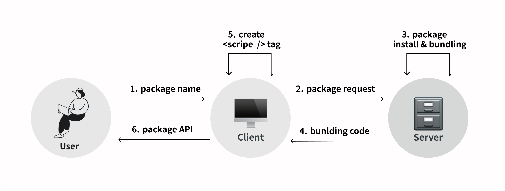

<br />

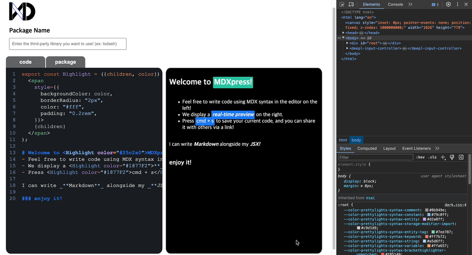

(라이브러리 요청시 script 태그가 생성되는 모습)

<br />

### 1-2. 라이브러리를 설치할수록 늘어만가는 서버의 부담

이 과정에서 발견한 문제점은, 사용자가 요청하는 라이브러리를 서버 자체에 설치한다는 점이었습니다.<br />
일회성으로 사용될 수 있는 라이브러리임에도 불구하고 서버에 직접 설치하여 유지하는 것은 서버에 큰 부담을 주며, 의존성 충돌 가능성도 증가시키므로 매우 비합리적이라고 판단되었습니다.

따라서, 라이브러리를 설치하고 해당 코드를 번들링 하는 과정을 `가상 환경`에서 수행한 후, 완료되면 해당 환경을 삭제하는 방식으로 효율적으로 관리할 수 있을 것으로 생각했습니다.<br />
이 방법은 각 사용자별로 독립된 환경을 제공함으로써, 다른 사용자의 작업에 영향을 주지 않고, 라이브러리의 충돌이나 **의존성 문제**를 효과적으로 방지할 수 있는 장점이 있습니다.

### 1-3. VM과 Docker중 어떤걸 사용할까

가상 환경을 구성하기 위해 고려해야 할 두가지 옵션으로는 `VM(가상 머신)`과 `도커(Docker)`가 있었습니다.

`도커`와 `VM`을 비교해본 결과

| 도커                                                                                                                                                                                                                       | VM                                                                                                                                                                 |
| -------------------------------------------------------------------------------------------------------------------------------------------------------------------------------------------------------------------------- | ------------------------------------------------------------------------------------------------------------------------------------------------------------------ |
| • OS 수준의 가상화를 제공.<br />• 컨테이너는 호스트 OS의 커널을 공유하기 때문에 도커 컨테이너는 가상머신에 비해 훨씬 가볍고, 시작 시간이 짧음.<br />이에따라 사용자가 라이브러리를 요청하고 결과를 신속하게 받아볼 수있음. | • 하드웨어 수준의 가상화를 제공.<br />• 각 가상머신은 완전한 게스트 운영 시스템을 가지며, 이 운영 시스템은 가상 하드웨어위에서 실행됨.                             |
| • 도커 이미지를 사용하여 애플리케이션과 그 의존성을 패키지화하면, 어느 환경에서든 일관된 방식으로 실행할 수 있음                                                                                                           | • 각 가상머신은 완전히 독립된 환경을 제공함.<br />이는 보안이 매우 중요한 환경에서 유리하고, 서로 다른 운영 체제를 필요로 하는 복잡한 의존성을 관리하는 데 적합함. |
|                                                                                                                                                                                                                            | • VM은 다양한 운영 체제와 환경을 지원할 수 있으며, 특정 하드웨어 기능을 에뮬레이션하는 데 유용함.                                                                  |

<br />

#### 자원 사용과 성능 측면에서 본다면?

- `가상머신`: 각 VM은 독립된 OS를 실행하기 때문에, 상대적으로 더 많은 디스크 공간과 메모리, CPU 자원을 사용함.

- `도커`: 컨테이너는 호스트 OS와 커널을 공유하기 때문에, 가상머신에 비해 훨씬 적은 자원을 사용하며, 시작시간도 빠름.

<br />

다양한 운영체제를 지원하는 것이 아니라 라이브러리를 격리된 환경에서 설치하는 것이 주된 목적이므로, 운영체제를 별도로 설치하여 환경을 구성하는 `VM(가상 머신)`은 과도한 엔지니어링이 될 수 있다고 생각하였습니다.<br />

이에 따라, 리소스를 효율적으로 사용하면서 충분한 격리를 제공하고, 동적인 라이브러리 설치 및 실행 요구사항을 효과적으로 지원할 수 있는 `도커(Docker)`의 도입이 더 적합하다고 판단하였습니다.

사용자가 서버에 패키지 설치를 요청할 때, 도커는 `"docker container image"`를 기반으로 한 컨테이너라는 가상 환경을 생성한 후, 이 환경 내에서 패키지의 설치 및 번들링 작업을 수행합니다.
작업이 완료된 후에는 번들링된 코드를 서버로 전송합니다.

모든 작업을 마친 컨테이너 환경은 자동으로 삭제되도록 로직을 구성함으로써, 서버 자원을 효과적으로 관리하고 의존성 충돌 문제를 해결할 수 있었습니다.

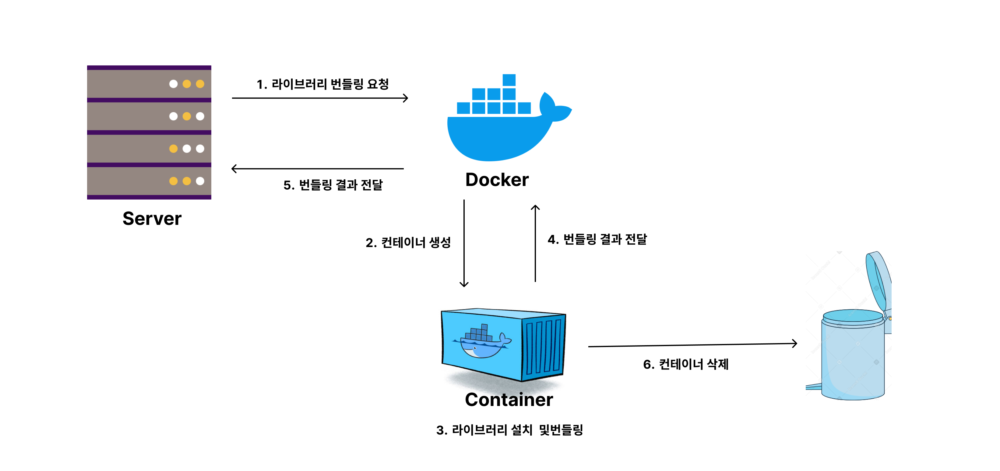

<br />
<br />

## 2. 로그인 없이 코드를 저장할 수 있는데, 그럼 DB관리는?

MDXpress 서비스는 로그인 기능이 존재하지 않기 때문에 사용자라면 누구나 작성하던 코드를 저장할 수 있고, 저장할 시 발급되는 링크를 통해서 누구나 저장했던 시점의 코드를 불러와 이어서 작업할 수 있습니다.
이러한 방식은 친화적인 사용자의 접근성을 보장해 줄 수 있었습니다.
다만, 데이터를 저장하는데 허들이 낮다는 것은, 데이터베이스에 많은 부담이 가는 구조였습니다.<br />
DB의 용량은 한정적이기 때문에 계속 데이터를 저장하게 된다면 용량이 초과되는 것은 예측 가능 한 문제였습니다.

### 2-1. DB를 어떻게 효과적으로 관리할 수 있을까?

제한적인 DB 용량 이라는 문제를 극복하기 위해서는 DB의 용량이 다 차기 전에 비워주어야 했었습니다.
이를 위해서 `cron` 이라는 라이브러리를 사용하여 일정 시간마다 DB를 초기화 해주려고 했었으나, 일정 시간마다 DB를 초기화 한다면 초기화 시간에 임박했을 때 코드를 저장한 사용자에게는 좋지 않은 사용자 경험이 될 것으로 판단했습니다. <br />

따라서 사용자 경험을 향상 시키기 위해서 한 사용자가 저장한 데이터를 유지하는 기간을 3일로 기준을 설정해준 뒤, 저장한 시점으로부터 72시간이 되는 시점에 해당 데이터를 삭제해주기로 했습니다. <br />

이러한 기능을 구현하기 위해서 MongoDB에서 제공하는 `TTL(Time-To-Live)`이라는 필드를 활용했습니다.

> [!NOTE] > `TTL` 인덱스는 MongoDB가 일정 시간 후 또는 특정 클럭 시간에 컬렉션에서 문서를 자동으로 제거하는 데 사용할 수 있는 특수 단일 필드 인덱스입니다. <br />
> 데이터 만료는 시스템에서 생성한 이벤트 데이터, 로그, 세션 정보 등 데이터베이스에 한정된 기간 동안만 유지되는 특정 유형의 정보에 유용합니다.

<br />

### 2-2. TTL을 이용해서 3일 뒤에 데이터를 지워주자

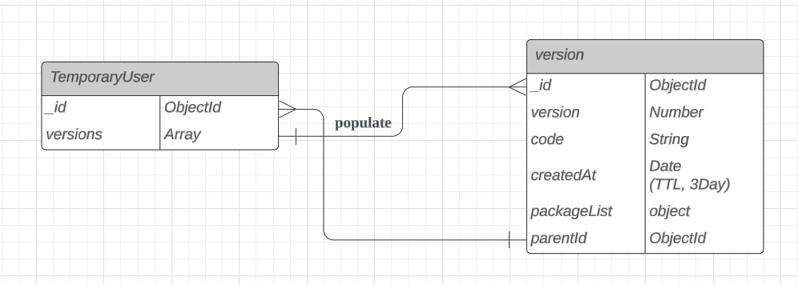
→ DataBase Schema 초안 <br />
<br />

사용자가 코드를 작성하다가 저장하면 새로운 1개의 버전이 생기며, 해당 버전은 `TTL(Time-To-Live)`을 설정하여 3일 후 자동 삭제되도록 조치하였습니다.<br />

초기에 DB 스키마를 보면, `TemporaryUser와`, `Version`이 존재합니다. <br />
사용자가 코드를 저장했을 때
공유 받은 링크를 통해서 접속한 사용자가 아니라면 `TemporaryUser document`와 `Version document`가 생성되고, TemporaryUser의 versions 배열 필드에 Version 필드의 ObjectId가 추가됩니다. <br />
이때 Version document에는 `TTL`을 적용하기 위해서 Version 스키마에 createdAt이라는 필드를 추가해서 생성된 순간으로부터 3일 뒤 자동으로 삭제되도록 설정해 주었고, <br />
document가 삭제되면, 삭제된 documentID를 참조하고 있는 TemporaryUser document의 versions 필드에서도 삭제된 버전의 ObjectId 값을 제거해주기 위해서 <br />
Version 스키마에 `parentId`라는 필드를 추가하여 `양방향 참조`를 하고 있는 스키마 구조를 작성하였습니다.<br />

이를 구현하기 위해서, Version document에서 삭제 이벤트가 발생할 시, 해당 ID 값을 참조하고 있는<br />
TemporaryUser의 versions 필드에서도 삭제된 Version의 ID가 제거될 수 있도록 `pre 미들웨어`를 활용하여 <br />
TTL에 의한 `remove이벤트` 가 발생할 시 해당 document가 삭제되기 전에 TemporaryUser의 versions 배열에서 먼저 제거될 수 있도록 로직을 구현하였습니다.

```js
// deleteFromParent.js
const TemporaryUser = require("../models/TemporaryUser");

async function deleteFromParent(next) {
  const parentCollection = await TemporaryUser.findById(this.parentId);
  const thisIndex = parentCollection.versions.findIndex(
    (value) => value === this._id,
  );

  parentCollection.versions.splice(thisIndex, 1);

  await parentCollection.save();

  next();
}

module.exports = deleteFromParent;
```

> [!TIP]
> pre미들웨어에서의 this값은 <br />
> 콜백함수를 `함수 선언식`으로 작성하게 되면 호출 객체(인스턴스)를 가리키고 <br /> `화살표 함수`로 작성하면 해당 스키마를 가리킵니다.

<br />

```js
// TemporaryUser.js
const deleteFromParent = require("../middlewares/deleteFromParent");

...

VersionSchema.pre("remove", deleteFromParent);
```

<br />

### 2-3. pre 미들웨어가 동작하지 않는다.

그러나 실제로 확인해본 결과 `pre` 미들웨어가 동작하지 않는 문제가 발생하였습니다.<br />

Mongoose에서 `pre` 미들웨어는 직접적인 document의 저장이나 삭제 같은 명시적인 작업에 반응하여 동작하지만,<br />
MongoDB에서 설정한 TTL 인덱스에 의해 자동으로 삭제되는 문서는 명시적인 삭제 명령을 사용하지 않고, MongoDB 내부적으로 문서를 삭제하기 때문에, Mongoose의 미들웨어나 모델의 이벤트 리스너와 감지 메커니즘을 통해 직접적으로 감지되지 않기 때문이었습니다.

<br />

### 2-4. changeStream을 이용하여 MongoDB 서버 내부를 직접 옵저빙 하자!

이를 해결하기 위해서 여러 가지 방법을 찾아보다가, MongoDB에서 `Change Stream`이라는 API를 제공한다는 사실을 알게 되었습니다.<br />

`Change Stream`은 Mongo DB 데이터베이스의 실시간 데이터 흐름으로 insert, update, replace, delete 등등 이벤트 데이터베이스에 대한 실시간 변경 이벤트를 제공해주는 API입니다.<br />
이를 활용하면 document가 `TTL`로 인해 삭제되는 것 또한 감지할 수 있었습니다.

다만 또 다른 문제점은 삭제를 감지할 수는 있지만 삭제된 document에 대하여 objectId와 같은 최소한의 정보만을 제공해주고, `full-document(전체 정보)`를 제공하지 않는다는 점이었습니다. <br />

이러한 제약사항 때문에 Version document의 다른 필드들은 사용하지 못하게 되고, 이는 곧 version document의 `parentId`필드값을 사용하지 못하게 됨을 의미했습니다. <br />
`parentId`를 사용하지 못하면 스키마가 `양방향 참조`를 하고 있는 의미가 없기 때문에
이러한 방향에 맞춰서 스키마 구조를 리팩토링 했습니다.

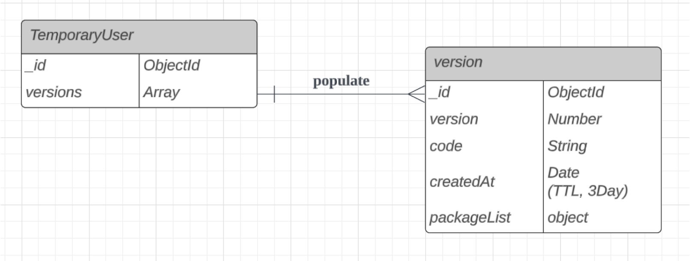

위 와 같이 DB스키마를 수정했고 기존의 pre 미들웨어를 사용하던 방법 대신에 <br />
TTL에 의해서 삭제된 Version document의 ObjectId를 활용하여 TemporaryUser document에서 해당 Version의 Id값을 갖고 있는지 순회를 통하여 확인 한 뒤, <br />
해당 Id값을 갖는 참조를 직접 제거해 주는 방식으로 수정하여 문제를 해결할 수 있었습니다.

<br />

## 3. textArea에 Syntax Highlighting을 입힐 수 있을까?

### 3-1 Syntax Highlighting은 어떻게 이루어지는걸까?

첫 에디터 구상 단계에서는 `codeMirror`, `monacoEditor`와 같이 강력하고 syntax Highlighting또한 기본적으로 지원해주는 기능이 풍부한 코드 에디터 라이브러리들이 많이 존재하기 때문에 이러한 라이브러리를 사용하여 구현하려고 하였으나<br />
기획단계가 구체화 될수록, 제가 구현하고자 하는 에디터는 사용자가 입력한 코드를 실시간 렌더링해주는 것이 주된 목적으로 명확해졌고,<br />에디터에서 그 이상의 복잡한 기능을 필요로 하지 않기 때문에 textArea를 사용하여도 제가 원하는 목적을 이룰 수 있음과 동시에 **단순성**과 **경량성**의 측면에서 이점을 가져갈 수 있다고 판단이 되어서 textArea를 사용하여 코드에디터를 구현하게 되었습니다.

이는 곧 `Syntax Highlighting`을 기능으로 구현해 주어야 함을 의미했습니다.

사용자가 입력한 문자열에 스타일을 입힌다는 과정이 에디터를 사용하면서는 당연하게 제공되는 기능이라고 생각을 했지만,막상 구현하려고 하니 이 기능을 제공해주기 위해서 어떤 매커니즘을 도입을 해야 할지 막막했습니다.

textArea를 통해 텍스트 에디터를 구현하게 되면 일반 텍스트만을 지원하기 때문에, 내부의 텍스트에 부분적으로 스타일을 적용하는 것은 불가능했기에<br />
여러 에디터 및 하이라이터 라이브러리들이 Syntax Highlighting을 어떻게 제공을 해주고 있는지 살펴보았습니다.

그 결과 대부분의 하이라이터들이 크게 `파싱`, `변환`, `생성` 이렇게 3단계를 통해서 하이라이팅을 구현하고 있는 것을 알 수 있었습니다.

그중에 `파싱 단계`는 아래와 같은 메커니즘으로 동작하고 있었습니다.

1. 사용자가 입력한 텍스트를 `스캐너(scanner)`라고도 하는 Lexical analyzer를 활용하여 정의된 규칙대로 문자 스트림(코드)을 읽고 이를 `토큰`으로 결합하여 결국 전체 코드 문자열이 `토큰 목록`으로 분할시킵니다.

2. 분할된 토큰 목록을 가져 와 `파서(parser)`라고도 불리는 Syntax analyzer를 통해서 검증을 실시하고
   **트리 구조로 변환**합니다.
   이때 만들어지는 트리를 `추상 구문 트리(Abstract Syntax Tree` 라고 부릅니다.

<br />

이렇게 AST를 구축하고, 적용된 플러그인에 기반하여 AST를 탐색하며 수정한 후, 수정된 AST로부터 새로운 코드를 생성하는 과정을 거치게 됩니다.

이러한 과정을 위해 MDX문법을 지원해주는 하이라이터 라이브러리인<br />
`starry-night`라이브러리를 사용하였고, 사용자가 입력한 문자열을 AST로 변환하고, 스타일을 입힌 코드로 바꿀 수 있었습니다.

이후 사용자가 textArea에 입력한 문자열을 라이브로 추출하여 내용이 바뀔 때마다 하이라이팅 된 결과를 받아올 수 있게 함으로써 실시간으로 사용자에게 하이라이팅 된 결과를 제공할 수 있었습니다.

```text
// 1. 사용자가 문자열을 입력
# h1
```

```js
// 2. 해당 문자열로부터 생성된 AST를 하이라이팅이 될 수 있는 AST로 수정
{
  type: "root",
  children: [
    {
      type: "element",
      tagName: "span",
      properties: {className: ["pl-mh"]},
      children: [
        {type: "text", value: "# "},
        {
          type: "element",
          tagName: "span",
          properties: {className: ["pl-en"]},
          children: [{type: "text", value: "hi"}]
        }
      ]
    }
  ]
}
```

```html
// 3. 수정된 AST를 기반으로 하이라이팅 된 새로운 코드 생성
<span class="pl-mh">
  <span class="pl-mh">#</span>
  <span class="pl-mh"> </span>
  hi
</span>
```

<br />

### 3-2. 어떻게 사용자가 입력하는 문자열이 하이라이팅 된 코드처럼 보이게 할 수 있을까?

하이라이팅 처리된 결과를 도출함으로써 <br />
**사용자가 문자열을 입력하는 textArea 영역**(이하 `EditorWrite`)과 입력한 코드를 **하이라이팅 처리하여 스타일이 입혀진 코드를 렌더링시켜주는 영역**(이하 `EditorView`)를 분리하였습니다.<br />

실시간으로 사용자가 입력하는 문자열이 하이라이팅된 것처럼 보이게 하는 구현 방안을 고민한 결과, `EditorWrite`와 `EditorView` 영역을 겹치게 한 후, 사용자가 입력하는 문자열은 숨기고 하이라이팅 처리된 문자열만을 보여주는 방법을 생각하게 되었습니다.<br />
사용자의 입력을 받을 `EditorWrite`의 position을 absolute로 설정하여 `EditorWrite` 영역을 `EditorView` 영역 위에 겹치도록 설정한 뒤,<br />
color와 background-color를 `transparent`로 설정함으로써 사용자에게는 현재 입력하고 있는 커서의 위치만 보이도록 하였습니다.<br />
이 방식을 적용한 결과, 사용자가 입력하는 것은 텍스트 영역이지만, 실제로 보는 것은 하이라이팅 처리된 코드가 되게끔 구현할 수 있었습니다.<br />

### 3-3. 두개의 영역 동기화 하기

성공적인 결과를 얻었으나, `EditorWrite`와 `EditorView`가 별도로 구분되어 있지만 사용자가 조작할 수 있는 영역은 EditorWrite영역이었기에, 해당 영역에 스크롤이 생기거나, 화면의 사이즈가 조절이 되면 EditorView영역도 동일하게 움직여야 했습니다. <br />
추가적으로, EditorWrite에서 작성하는 문자열의 위치와, 렌더링 되는 문자열의 위치가 완벽하게 동일해야 했습니다.<br />

이 문제는 두 영역 내에 작성된 문자열의 스타일을 동일하게 설정하고, 입력된 문자열이 제공된 영역을 초과하여 스크롤이 발생하면 `EditorWrite`의 scrollLeft, scrollTop값을 추출하여 globalState로 관리하였고,<br />
해당 상태값을 `EditorView`의 scrollValue에 동일하게 설정함으로써 두 영역의 스크롤 위치를 동기화시켜 줄 수 있었습니다.<br />

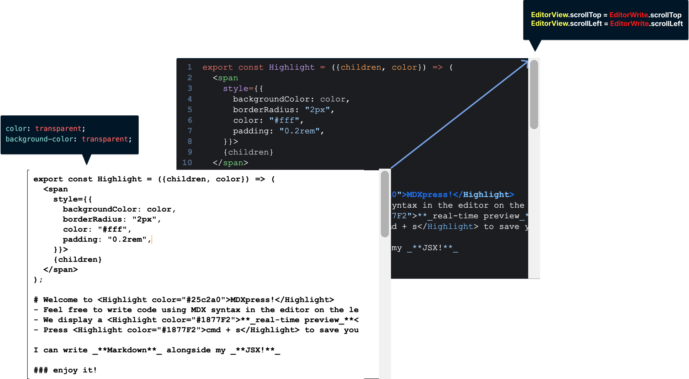

<br />

이와 같은 방법으로 마치 두 개의 영역이지만 실제로는 하나의 영역처럼 사용자가 느끼도록 할 수 있었습니다.

<br />
<br />

# 🧪 Test

### 서버에서 데이터를 정상적으로 잘 가져와서 렌더링 할 수 있을까?

기존에 테스트 코드를 작성해본 경험으로는 각 컴포넌트의 무결성을 보장하고, 각각의 렌더링에 초점을 둔 `유닛 테스트`를 작성해본 경험이 있었습니다. <br />
그러나 `유닛 테스트`만으로는 해당 유닛들이 조합되어서 실행되는 과정에서도 문제가 없음을 단정지을 수 없었고, <br />
그러다 보니, 서버로부터 데이터를 응답 받았을 경우 해당 데이터를 기반으로 컴포넌트가 잘 렌더링 되는지, 각각의 Unit들이 합쳐져서 서비스가 내가 원하는 흐름대로 돌아가는지에 대한 검증을 통해 근거를 확보하고 싶었습니다. <br />
통합 테스트의 정상적인 결과는 곧 해당 서비스의 신뢰성을 더해줄 것 이라고 생각했기 때문입니다. <br />
즉, 클라이언트와 서버의 통합 테스트를 작성해보고 싶은 개인적인 욕심이 생겼고, <br />
이에 따라서 이번 프로젝트를 진행하면서 단위테스트 뿐만 아닌 서버로부터 데이터를 응답으로 받았을 경우, 해당 데이터를 정상적으로 잘 가져와서 렌더링 하는지, Unit에 대한 `통합 테스트` 를 작성해 보기로 했습니다.

<br />

따라서 클라이언트 테스트 환경에서도 서버를 실행하고 네트워크 요청 보냄으로써 테스트를 하게 되면 정상적으로 테스트가 진행 되었지만 클라이언트의 테스트환경이 서버에 자나치게 의존하고 있었습니다.<br /><br />
이 말은 클라이언트 측에서 통합 테스트를 진행하려면 서버가 항상 실행중이여야만 한다는 것 을 의미했고,
또한 서버가 정상적으로 실행되지 않는 경우에는 테스트가 불가능 하다는 뜻 이기도 했습니다.
<br />

이는 테스트의 독립성을 떨어트리고, 서버가 다운되거나 응답이 지연될 경우, 클라이언트 측 테스트가 실패할 수 있음으로 이는 테스트 결과의 신뢰성을 떨어뜨리게 됩니다. <br />
저는 이번 테스트코드를 작성하는 큰 이유중에 하나가 결과로부터 서비스의 신뢰성을 더해주는 것이었기 때문에 해당 문제는 반드시 짚고 넘어가야 했었습니다.
<br /><br />

### 테스트시 서버 의존성을 끊어내자

이번 통합 테스트는 **두가지**를 중점에 두고 테스트 코드를 작성하였습니다.

1. **`유닛`들이 모두 조합되어서 실행이 되었을 때 잘 작동하는지**
2. **`네트워크 요청-응답` 라이프 사이클이 정상적으로 이루어 지고, 해당 결과를 기반으로 잘 렌더링하는지** <br />
   즉, `실제와 동일한 동작`을 보장하는 지

<br />
따라서 이를 어떻게 해결할 수 있을까를 생각해보았을 때 가장 먼저 생각났던 방법은 <br />
실제 서버에서 응답으로 제공하는 데이터를 테스트 환경에서 변수로 저장을 해놓고, 해당 데이터를 렌더링 하는 방법 이었습니다. <br /><br />

다만, 이는 제가 세운 **_두번째 목적_** 에 위배되었습니다.<br />
서버에서 제공하는 데이터를 그저 변수에 저장해두고 렌더링이 잘 되는지 테스트를 하는 과정은
유닛 테스트를 진행하는 것과 다를 것이 없었고, 중요한 것은<br />
_**네트워크 요청-응답 라이프 라이클이 정상적으로 이루어 지는지를 확인할 수 없었다는 점**_ 이었습니다. <br/>

따라서 첫번째 방법은 실패로 돌아갔습니다. <br />
여기서 두번째 목적인 실제와 같은 동작을 보장하는 테스트를 작성하려면 `axios`든, `fetch`든 최종적으로는 `XHR`을 보내야 하고, 해당 요청을 intercept해주는 `API mocking library`를 도입하기로 했습니다.

따라서 최종적으로 `Mock Service Worker`, `Miragejs` 두개의 라이브러리를 후보로 선정했고, 이에 대해서 저의 상황에 어떤 라이브러리가 적합할지 비교를 해보기 시작했습니다.

|           | Mirage                                                                                                                                                                                                                                                                                          | MSW                                                                                                                                                                                                                                                                                      |
| --------- | ----------------------------------------------------------------------------------------------------------------------------------------------------------------------------------------------------------------------------------------------------------------------------------------------- | ---------------------------------------------------------------------------------------------------------------------------------------------------------------------------------------------------------------------------------------------------------------------------------------- |
| 환경      | 브라우저 환경은 지원하나<br />node환경을 완전히 지원하지는 않음                                                                                                                                                                                                                                 | 브라우저, node환경 둘다 지원함                                                                                                                                                                                                                                                           |
| 동작 방식 | 내부적으로 fetch나 XMLHttpRequest를 몽키 패칭하여 동작하는 Pretender.js를 사용함. <br /><br /> 노드에서 실행되지만 브라우저와 유사한 환경(Jest와 같은 도구와 jsdom과 같은 것이 있는 경우)에서만 제한적으로 실행됨. <br /><br /> 따라서 React 앱의 서버 측 API 요청을 모킹하는 데 사용할 수 없음 | `Service Worker`를 사용하여 네트워크 요청을 가로챔. <br /><br /> Service Worker를 사용할 때의 가장 큰 장점은 모킹 요청이 개발자 도구의 네트워크 탭에 표시됨. <br /><br /> 이는 곧 브라우저의 관점에서 보면 실제 HTTP 요청과 동일하고, 실제 서버 측 API와 상호 작용하는 것과 매우 유사함. |
| 특징      | 인메모리 데이터베이스를 제공하기 때문에 복잡한 데이터 관계를 모델링하는 데 적합함                                                                                                                                                                                                               | 데이터 모델링 기능을 기본으로 제공하지는 않음. <br />그러나, 개발자가 원할때 `@mswjs/data`와 같은 패키지를 활용하여 데이터 우선 접근 방식의 API 모킹을 사용할 수 있음                                                                                                                    |

<br />

두 라이브러리는 굉장히 비슷하다고 생각하지만 <br />
종합적으로 판단해 보았을 때 저는 앞서 말했듯이 **실제와 동일한 동작을 보장하는지**를 중점으로<br />
테스트 코드를 작성하는것이 개인적인 목표였기에 `MSW` 는개발자도구의 네트워크 탭에 표시되는 실제 네트워크 요청이 가능한 반면 <br/>`Mirage`는 순전히 런타임 브라우저에서 실행되므로 가로챈 요청이 해당 브라우저 환경에 제한된다는 점을 고려하여`MSW`를 사용하기로 결정을 했습니다.
<br /><br />

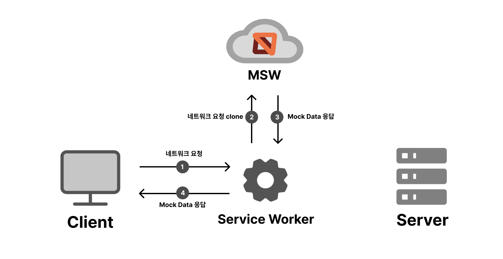
> MSW의 간단한 동작 방식

<br /><br />

따라서 MSW를 사용하기 위한 디렉토리 구조를 아래와 같이 설정한 뒤

```
├── src
│   ├── mocks
│   │   ├── handler.js
│   │   └── server.js
```

<br />

`server.js`에 클라이언트 측 네트워크 요청을 중간에 가로챌 `모킹 서버`를 구현해주었고,

```js
import { setupServer } from "msw/node";
import handlers from "./handler";

const server = setupServer(...handlers);

export default server;
```

<br />
실제 서버에서 제공한 API endPoint와 동일한 라우팅 핸들러를 설정해 주었고 <br />
해당하는 endPoint에 대해서 상수처리를 한 뒤, 서버에서 응답으로 보내줄 데이터를 Mocking하여 응답하도록 작성하였습니다.

```js
// 상수처리된 endPoint
const {
  MOCK_REQUEST_PACKAGE_URL,
  MOCK_REQUEST_BOILERPLATE_URL,
  MOCK_REQUEST_SAVE_URL,
} = CONSTANTS;

const handlers = [
  // 네트워크 요청 모킹
  http.get(MOCK_REQUEST_BOILERPLATE_URL, ({ params }) => {
    const { id, version } = params;

    if (id === "first" && version === "first") {
      return HttpResponse.json({
        result: "OK",
        status: 200,
        content: {
          targetCode: "boilerPlate code",
          bundleCodeList: [],
        },
      });
    }

    // Mock Data로 응답
    return HttpResponse.json({
      result: "OK",
      status: 200,
      content: {
        targetCode: "saved code",
        bundleCodeList: [
          {
            packageInformation: "lodash 1.0",
            bundledPackageCode: "bundled package code",
          },
        ],
      },
    });
  }),
  ....
```

이렇게 MSW를 도입함으로써 테스트 환경에서 통합 테스트시 서버의 의존성을 끊어내어 테스트의 독립성을 보장해 줄 수 있었고,
서비스의 신뢰성을 높일 수 있었습니다.

<br />

### MSW 도입 후 느낀점

MSW를 도입하여 통합 테스트를 작성하면서 다양한 MSW 활용성에 대해서 생각해보게 되었습니다. <br />
이번에는 테스트 코드에 국한하여 MSW를 사용해보았지만, 이는 MSW를 온전히 사용한 것 이라고 생각하지 않습니다. <br />
해당 프로젝트를 진행하기 전 팀 프로젝트를 진행하는 과정에 있어서 기능을 구현하는 순서를 정할때 BackEnd를 먼저 구현하여 API개발을 모두 완료한 뒤 FrontEnd를 구현하는 순서로 개발을 했었는데, <br />
이는 당연하게도 API가 구현되기 전에는 FrontEnd를 구현하는데 있어서 많은 어려움이 있을 것 이라고 생각했기 때문입니다. <br /><br />
만약, MSW를 도입하여 서비스 구현 과정에서도 사용한다면 협업으로 프로덕트를 개발해야 하는 경우 마주하게 되는 API 문제점들을 해결 할 수 있고, <br />
FrontEnd와 BackEnd를 병렬적으로 구현할 수 있게 됨에 따라서 개발 생산성이 크게 향상 될 것 같다고 느꼈습니다.

<br />
<br />

# ♻️ Refactoring(진행중)

### 1. TypeScript

타입스크립트 공부를 병행하며 점진적으로 마이그레이션 중 입니다. <br />

`자바스크립트`는 `동적 타이핑 언어` 이므로 런타임 시점에 변수의 타입이 결정되게 됩니다.
이러한 특징은 코드를 작성할때 자율성을 보장해주긴 하지만, 제가 의도하지 않은 타입의 값이 변수에 할당될 경우
런타임 에러가 발생할 수 있다는 치명적인 단점이 존재합니다. <br />
지금은 PropTypes를 사용하여 최소한의 타입 보장을 해주었지만, 타입스크립트로 마이그레이션을 함으로써 아래와 같은 효과를 기대해볼 수 있습니다.

- **기대 효과**

1. **_타입을 지정해줌으로써 시스템의 안정성 보장_**
2. **_직관적이고 에측 가능한 코드가 됨으로써 개발 생산성 향상_**

<br />

### 2. Web Worker로 백그라운드 스레드 활용해보기

현재 코드는 메인 스레드에서 mdx문법을 파싱 및 트랜스파일하여 렌더링까지 모두 담당하고 있습니다. <br />
`웹 워커(Web worker)`는 스크립트 연산을 웹 애플리케이션의 메인 스레드와 분리된 별도의 백그라운드 스레드에서 실행할 수 있는 기술입니다. <br />

- **기대효과**

1. **_백그라운드 스레드를 활용하여 로직을 분리함으로써 시스템의 효율성을 향상_**

<br />
<br />

# 🤔 Memoir

이번 프로젝트를 통해 본인을 객관적으로 바라보며 단점을 파악할 수 있는 경험이 되었다고 생각합니다.<br />
프로젝트에서 새로운 기술 스택과 익숙하지 않은 개념들을 많이 다뤄 보았습니다.<br />
새로운 기술 도입을 시도하며 코드 작성보다 학습하는 데 더 많은 시간을 할애했을지도 모릅니다.<br />
그 과정에서 _**"이 방식으로 로직을 작성하는 것이 맞는 방법인가?"**_ 라는 의문을 수백 번도 더 가졌습니다.<br />

로직이 완전히 바로 서지 않으면 코드 작성을 시작하지 못하는 스타일이었으나, 새로운 기술과 개념에 로직을 완전히 세우려 하다 보니 우선순위를 정하지 못하고 생각만 많아져 코드 작성을 시작하지 못한 경우가 많았습니다.<br />
지금 와서 생각해본다면 새로운 기술이나 익숙하지 않은 것에 도전하는 데 있어 자신감이 부족했습니다.<br />
_**"고민만 하고 실행하지 않으면 고민이 무거워진다"**_ 라는 말이 적절할 것 같습니다.<br />그래서 _**"일단 시도해 보자. 되지 않으면 다시 시작하면 된다"**_ 는 생각으로 코드를 작성해 보니 걱정했던 것과 달리 큰 문제가 발생하지 않았고, 점점 자신감이 붙어서 결과적으로 프로젝트를 완성할 수 있었습니다.
<br />

프로젝트를 진행하며 새로운 개념에 부딪힐 때마다 어떻게 구현해야 할지 막막함을 느꼈고, 라이브러리를 분석하는 과정에서 예상치 못한 코드 양에 좌절하기도 했습니다.<br />
그러나 작업 스타일을 조금 바꿔 보니 문제가 해결되는 과정을 경험하면서 다양한 시각을 가지게 되었고, 새로운 도전에 대해 조금은 자신감을 갖게 되었습니다.<br />

개발 분야는 흐름과 트렌드가 빠르게 변하기 때문에, 개발자는 항상 새로운 기술을 학습하고 익숙해져야 합니다.<br />
이 경험은 앞으로 개발자로서 성장하기 위한 역량을 더욱 강화하는 소중한 기회가 되었다고 생각합니다.
